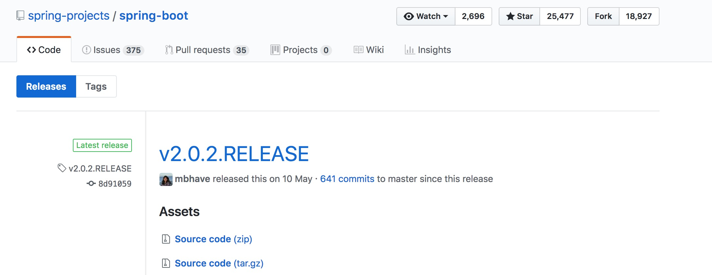

这个版本是继4年前Spring Boot 1.0 之后的第一个主要版本，也是第一个正式支持Spring Framework 5.0的发行版本。

<blockquote>
Spring Boot版本发布列表：https://github.com/spring-projects/spring-boot/releases/
</blockquote>



### Spring Boot 2.0 新特性
Spring Boot 2.0 和 1.0 比都有哪些变动和新特性呢？

JDK最低要求1.8+，并支持1.9；

支持Spring webflux/webflux.fn响应式的web编程；

提供Spring Data Cassandra, MongoDB, Couchbase和Redis的响应式自动配置及starter POMs；

支持嵌入式的Netty；

HTTP/2的支持：Tomcat, Undertow and Jetty；

全新的体系结构，支持Spring MVC、WebFlux和Jersey；

增强了Micrometer集成，以Atlas, Datadog, Ganglia, Graphite, Influx, JMX, New Relic, Prometheus, SignalFx, StatsD and Wavefront为基础的度量指标；

Quartz调度支持；

极大简化了安全自动配置；

<blockquote>
更多详细的新特性请看官方说明： https://github.com/spring-projects/spring-boot/wiki/Spring-Boot-2.0-Release-Notes
</blockquote>

需要注意的是，许多配置属性在 Spring Boot 2.0 中已经被重命名或被删除，为了方便从 1.x 升级，Spring Boot 发布了一个新的 spring-boot-properties-migrator 模块。只要将其作为依赖添加到项目中，它不仅会分析应用程序的环境并在启动时打印诊断信息，而且还会在运行时阶段为项目临时将属性迁移至新的配置方式。

<blockquote>
升级文档：https://github.com/spring-projects/spring-boot/wiki/Spring-Boot-2.0-Migration-Guide
</blockquote>

### Spring WebFlux
Spring WebFlux是一个非阻塞的函数式Reactive Web框架，可以用来构建异步的、非阻塞的、事件驱动的服务，在伸缩性方面表现非常好。名称中的Flux来源于Reactor中的类Flux。

Spring MVC是同步阻塞的IO模型，资源浪费相对比较严重，当我们在处理一个耗时的任务时，例如上传一个较大的文件时，服务器的线程一直在等待接收文件，这期间什么也做不了，等到文件接收完毕可能又要写入磁盘，写入的过程线程又只能在那等待，非常浪费资源。而Spring WebFlux是这样做的，线程发现文件还没接收好，先去做其他事情，当文件接收完毕后通知该线程来处理，后续写入磁盘完毕后再通知该线程来处理，通过异步非阻塞机制节省了系统资源，极大的提高了系统的并发量。因此对于微服务下的IO密集型的Service来说，WebFlux是一个不错的选择。


左侧是传统的基于Servlet的Spring Web MVC框架，右侧是5.0版本新引入的基于Reactive Streams的Spring WebFlux框架，从上到下依次是Router Functions，WebFlux，Reactive Streams三个新组件。

Router Functions: 对标@Controller，@RequestMapping等标准的Spring MVC注解，提供一套函数式风格的API，用于创建Router，Handler和Filter。
WebFlux: 核心组件，协调上下游各个组件提供响应式编程支持。
Reactive Streams: 一种支持背压（Backpressure）的异步数据流处理标准，主流实现有RxJava和Reactor，Spring WebFlux默认集成的是Reactor。
在Web容器的选择上，Spring WebFlux既支持像Tomcat，Jetty这样的的传统容器（前提是支持Servlet 3.1 Non-Blocking IO API），又支持像Netty，Undertow那样的异步容器。不管是何种容器，Spring WebFlux都会将其输入输出流适配成Flux<DataBuffer>格式，以便进行统一处理。

值得一提的是，除了新的Router Functions接口，Spring WebFlux同时支持使用老的Spring MVC注解声明Reactive Controller。和传统的MVC Controller不同，Reactive Controller操作的是非阻塞的ServerHttpRequest和ServerHttpResponse，而不再是Spring MVC里的HttpServletRequest和HttpServletResponse。

简单的使用webFlux （springboot）
``` javascript
<parent>
    <groupId>org.springframework.boot</groupId>
    <artifactId>spring-boot-starter-parent</artifactId>
    <version>2.0.0.M4</version>
    <relativePath/> <!-- lookup parent from repository -->
</parent>
```
webFlux 的依赖包
``` javascript
<dependency>
    <groupId>org.springframework.boot</groupId>
    <artifactId>spring-boot-starter-webflux</artifactId>
</dependency> 
```
创建Route：
``` javascript
@Configuration
public class WebRoutes {

    @Bean
    public RouterFunction<ServerResponse> route() {
        return RouterFunctions.route(
                GET("/"), request -> {
                    Mono<User> user = Mono.just(new User("1", "a"));
                    return ok().body(fromPublisher(user, User.class));
                });
    }
}
```

### 响应式自动配置

添加Redis相关的配置信息到application.yml文件内
``` javascript
spring:
  application:
    name: spring-boot-redis
  jpa:
    database: mysql
    show-sql: true
  datasource:
    druid:
      username: root
      password: 123456
      url: jdbc:mysql://localhost:3306/test
  # 配置Redis的连接密码
  redis:
    password: hengyuboy
```
由于Redis有很多默认的配置，默认连接localhost上的Redis，我们这里仅仅配置连接的密码就可以了，其他的都使用默认的配置。

开启缓存
在程序入口类上添加@EnableCaching注解完成开启缓存
``` javascript
/**
 * spring-boot-redis集成项目启动类入口
 *
 * @EnableCaching 注解配置启用缓存，自动配置配置文件的配置信息进行条件注入缓存所需实例
 */
@SpringBootApplication
@EnableCaching
public class SpringBootRedisApplication {
}
```
测试添加缓存
``` javascript
@Cacheable(cacheNames = "user.service.all")
public List<TestUserEntity> findAll() {
    return userRepository.findAll();
}
```

### spring对kotlin的支持
spring在5.0版本提供了对kotlin的支持， 
- 空安全api 
- 支持kotlin不可变类通过optional参数和默认值 
- 函数式bean定义 DSL 
- 函数式routing定义 DSL 
- 利用Kotlin具体的类型参数指定显式类避免使用序列化/反序列化的各种API比如RestTemplate或WebFlux的API。 
- kotlin 空安全支持 @Autowired或@Inject 和 @RequestParam、@RequestHeader等 
- kotlin脚本同时支持 springMVC 和 Spring WebFlux 
- 支持kotlin构造器自动注入 
- kotlin反射用来定义接口方法参数
