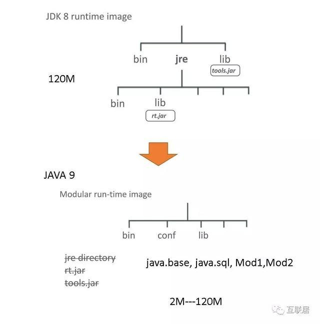
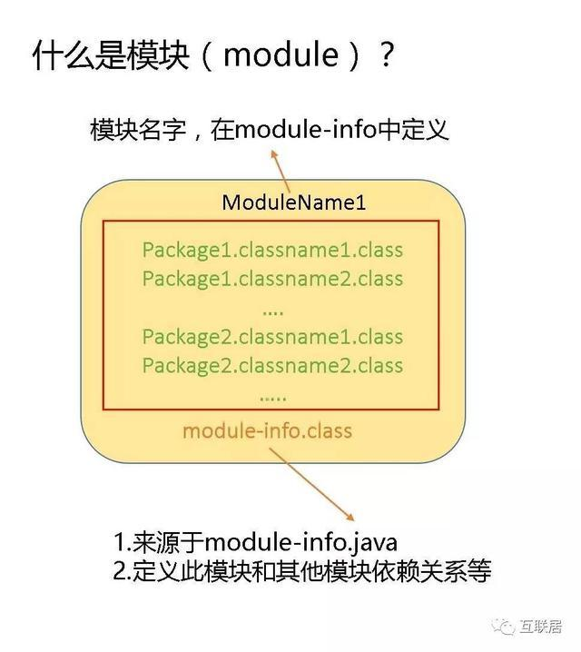
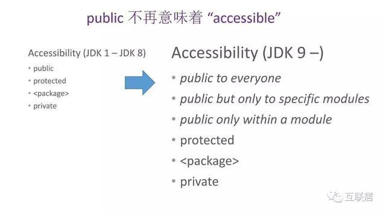
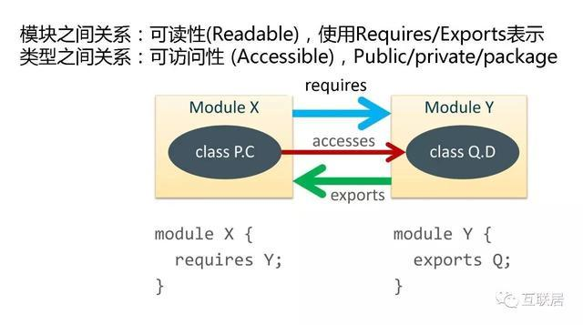
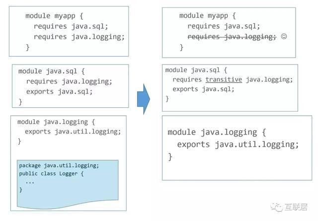
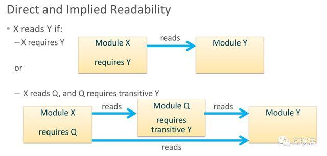
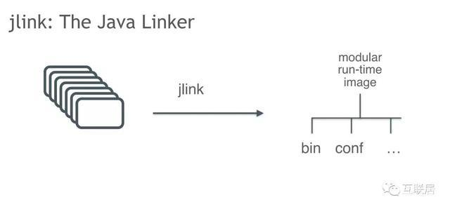
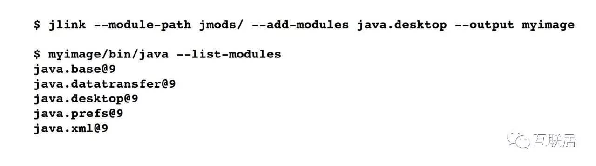
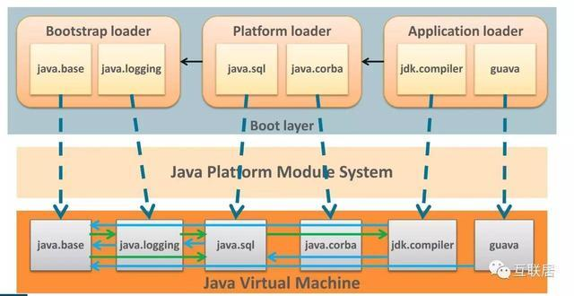

JAVA在1995年发布第一个版本后，经过了20多年的更新迭代，暴露出一些问题：
java 运行环境的臃肿。
熟悉Java的同学，都知道JRE有一个超级大rt.jar（例如，Java 8的rt.jar中有65M），运行一个hello world，你也需要一个数百兆的JRE环境。
后期引入的jar包，不同版本的类库交叉依赖导致引入的jar越来越多，然而好多jar的功能并没有用。



为了解决此类问题，JAVA9 推出了模块化系统。模块化系统本身叫jigsaw，后叫modularity。

模块化的功能有几个目的：

让Java的SE程序更加容易轻量级部署
改进组件间的依赖管理，引入比Jar粒度更大的Module
改进性能和安全性
如果用更加简单解释，那就是“解决Classpath地狱问题，改进部署能力”。Module的内容比较多，为了由浅入深，我按照一些问题和我的理解来介绍模块化。

### 1.什么是Java Module(模块）
模块就是代码和数据的封装体，代码是指一些包括类型的Packages。Package是一些类路径名字的约定，而模块是一个或多个Packages组成的一个封装体。



### 2. 模块的代码例子
模块的是通过module-info.java进行定义，编译后打包后，就成为一个模块的实体；在模块的定义文件中，我们需要指定模块之间的依赖靠关系，可以exports给那些模块用，需要使用那些模块(requires) 。下面是一个例子：

``` javascript
module com.foo.bar {
requires org.baz.qux;
exportscom.foo.bar.alpha;
exportscom.foo.bar.beta;
}
META-INF/
META-INF/MANIFEST.MF
module-info.class
com/foo/bar/alpha/AlphaFactory.class
com/foo/bar/alpha/Alpha.class
...
```

### 3.JDK8 和JDK9有什么不一样？
JDK８的JRE的部署是一个单体模式，一个超大的rt.jar(大约60多兆），tools.jar也有几十兆，即使使用一个Hello Worlds，你也需要一整套上百兆的JRE环境。
JAVA 9 引入模块后，将所有的类组织成模块形式，模块之间有着优美的依赖关系（至少现在很整齐，不知道过几个版本会不会继续保持优雅）。

### 4. Public 不再意味着Accessible(可访问了)
模块之间的关系被称作readability（可读性），代表一个模块是否可以找到这个模块文件，并且读入系统中（注意：并非代表可以访问其中的类型）。在实际的代码，一个类型对于另外一个类型的调用，我们称之为可访问性(Accessible)，这意味着可以使用这个类型； 可访问性的前提是可读性，换句话说，现有模块可读，然后再进一步检测可访问性（安全）。
在Java 9中， Public不再意味着任意的可访问性！


<center><u>Public不再意味着任意的可访问性！</u></center>


5.什么是模块的Transitive 引用（间接引用）
举个例子：



因此标记了transitive可以可以提供一个间接可读性。在myapp中，可以直接引用Logger类了。



### 6. Module 和Maven是什么关系
看完Module，这么详细的表达依赖关系，是不是和什么软件很相似？是不是想起了Maven还是Gradle? 仔细想象，Modular和它们还是不一样的。

``` javascript
Modular是系统内置用于表述组件之间的关系，对于版本的管理还是处于最原始的状体。它管理一种强制的依赖关系。
Maven有两个核心功能 a) 组件的依赖管理，特别是版本的管理，这种依赖是逻辑上的，并非强制的 b)管理开发过程中的各种任务，初始化，测试等等。
```

### 7. JLink介绍
JLink是将Module进行打包的工具，帮助目标机器的部署。打包后的文件将非常精简。



<center><u>jLink工作示意图</u></center>



<center><u>jLink工作指令示范</u></center>

### 8 Module的原理和实现
在内部实现中，整个过程非常繁琐复杂，大概有几件事情；

#### a)将系统内部类进行模块化
这样不用在区分太多J2ME, J2SE，J2EE了，大家都是用模块作为沟通语言。这需要整理所有的类和它们调用关系，调用频次等，把系统类模块化，这可能最复杂的一部分，不过结果是完美的。

#### b) 将ClassLoader分级
将ClassLoader分为三个级别，Bootstrap Loader具有最高优先级和权限，主要是核心的系统类；Platform Loader用于扩展的一些系统类，例如SQL,XML等；Application Loader主要用于应用程序的Loader。在这三个级别的Loader下面有一个统一Module 管理，用于控制和管理模块间的依赖关系，可读性，可访问性等。 注意，ClassLoader在Java 9中的类装载逻辑和之前一样，但是，通过模块管理系统，ClassLoader.FindClass的能力，将被限制在readable&accessible的条件下，而不是之前的简单的Public条件。

